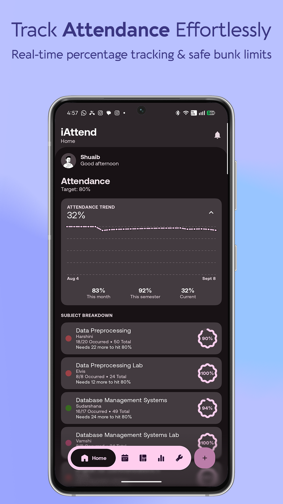
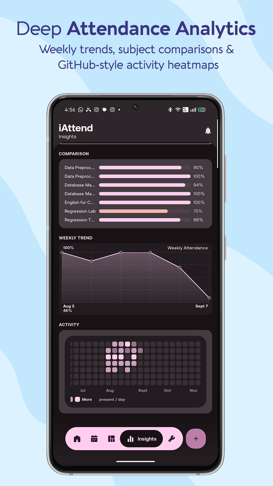
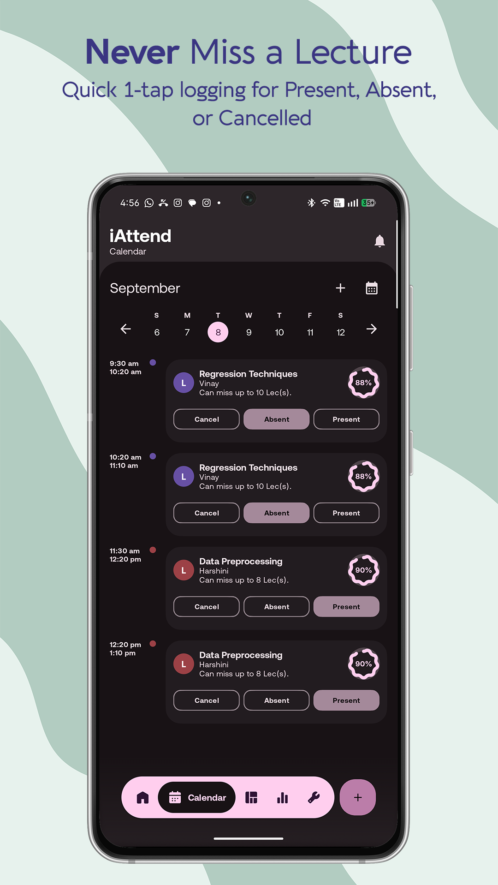
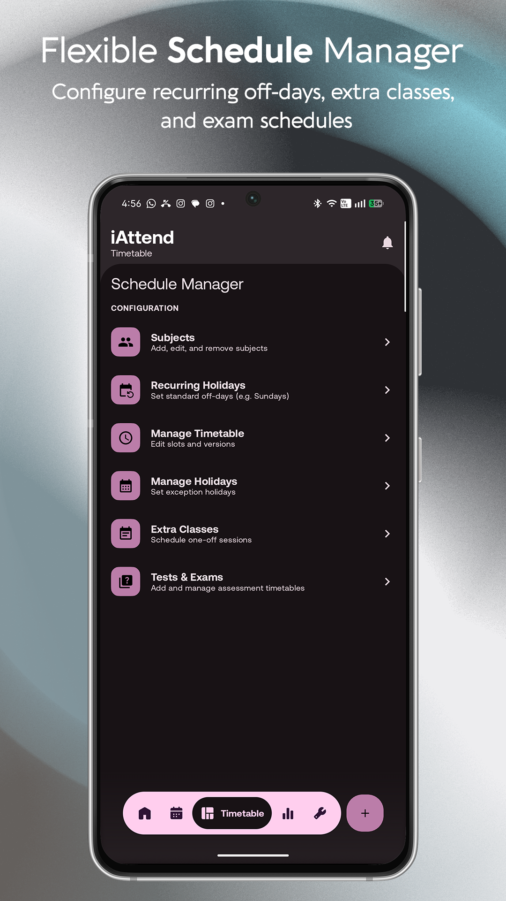
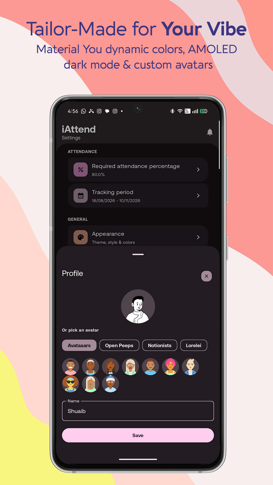

<p align="center">
  
</p>

<h1 align="center">iAttend - Modern Offline Attendance & Timetable Manager</h1>

<p align="center">
  &nbsp;&nbsp;
  &nbsp;&nbsp;
  &nbsp;&nbsp;
  
</p>

<p align="center">
  <strong>iAttend</strong> is a free, privacy-first, offline attendance and timetable tracker for Android, built with <strong>Jetpack Compose & Material You</strong>. Designed to handle real-world college schedule chaos with mid-semester timetable swaps, safe bunk limits, ad-hoc extra classes, and an interactive home screen widget.
</p>

<p align="center">
  <a href="https://github.com/shuaib-07/iAttend/releases/latest">
    
  </a>
</p>

---

## 📸 Screenshots

<div align="center">
  <table border="0" cellpadding="0" cellspacing="2" style="border-collapse: collapse;">
    <tr style="border: none;">
      <td width="32%" style="border: none; padding: 2px;"></td>
      <td width="32%" style="border: none; padding: 2px;"></td>
      <td width="32%" style="border: none; padding: 2px;"></td>
    </tr>
    <tr style="border: none;">
      <td width="32%" style="border: none; padding: 2px;"></td>
      <td width="32%" style="border: none; padding: 2px;"></td>
      <td width="32%" style="border: none; padding: 2px;"></td>
    </tr>
  </table>
</div>

---

## 💡 Why iAttend?

Most attendance apps assume your college schedule stays identical for the entire year. In reality, college timetables are pure chaos:
- **Mid-term Schedule Changes:** Timetables change midway through the semester, and traditional apps force you to delete your timetable or wipe your entire attendance record just to update it.
- **Sudden Extra Classes:** Ad-hoc or weekend lectures get scheduled with no clean way to log them.
- **The Golden Question:** *"How many classes can I afford to bunk right now without falling below the minimum percentage?"*

iAttend solves all of this:
- **Versioned Timetables:** Create multiple timetable versions across the semester without losing historical attendance records.
- **Smart Bunk Calculator:** Instantly tells you how many lectures you can safely skip or need to attend to hit your goal.
- **Ad-hoc Extra Classes:** Log sudden one-off lectures on the fly without breaking your base schedule.
- **Interactive Home Screen Widget:** Glance at your schedule, cycle dates with `<` and `>`, and see color-coded status shading right on your home screen.

---

## 🚀 Key Features

| 🗓️ **Multiple Timetable Versions** | 🧮 **Bunk Calculator** |
| :--- | :--- |
| Switch schedules mid-semester seamlessly without resetting past attendance history or class counts. <br><br> `Timetables` `Mid-term Swaps` `History Preserved` | See exactly how many classes you can afford to skip (or need to attend) to meet your target percentage. <br><br> `Target %` `Real-time` `Safe Bunking` |
| ➕ **Extra Classes & One-Offs** | 🏖️ **Holidays & Off-Days** |
| Schedule ad-hoc or sudden weekend lectures on the fly without breaking your base timetable. <br><br> `One-offs` `Ad-hoc` `Weekend Sessions` | Configure weekly off-days and public holidays once so they don't count against your attendance. <br><br> `Recurring Off-Days` `Semester Breaks` |
| 📝 **Exams, Tests & Portions** | 🔔 **Smart Notifications** |
| Track test dates, marks, syllabus portions, and credit weightages with dedicated reminders. <br><br> `Exam Tracker` `Subject Weightage` `Syllabus` | Get alerts before class starts, prompt after class to log attendance, and ahead of exams. <br><br> `Class Alerts` `Post-class Prompt` `Auto-dismiss` |
| 📱 **Home Screen Widget** | 🎨 **Dynamic Themes** |
| Interactive widget with day navigation (`<` / `>`), status shading (Present/Absent/Cancel), and EXTRA badges. <br><br> `Glance Widget` `Instant Navigation` `Status Shading` | Supports Material You dynamic colors, Light, Dark, pure AMOLED black, and custom accent palettes. <br><br> `Material You` `AMOLED` `Custom Accents` |
| 📦 **Backup & Share** | 🔒 **100% Offline & Private** |
| Export your timetable as a portable backup file to easily share schedules with classmates. <br><br> `Import / Export` `Share Schedule` | No account required, zero tracking, and no analytics. All your data stays strictly on your device. <br><br> `Room DB` `No Analytics` `Local-Only` |

---

## 🎨 Design Inspirations & Credits

Special thanks to the open-source community and the following projects for design & architectural inspiration:
* [Zenith](https://github.com/1372Slash/Zenith) by 1372Slash
* [Cashiro](https://github.com/ritesh-kanwar/Cashiro) by ritesh-kanwar
* [minus](https://github.com/isaacsa51/minus) by isaacsa51
* [RvSystem-Monitor](https://github.com/Rve27/RvSystem-Monitor) by Rve27
* [Attendo](https://github.com/jarvis1704/Attendo) by jarvis1704

**Icons & Assets:**
* Badges by [m3-Markdown-Badges](https://ziadoua.github.io/m3-Markdown-Badges/)
* Animated & static icons sourced from [Lordicon](https://lordicon.com/) and [useAnimations](https://useanimations.com/)
* Avatars generated via [DiceBear](https://dicebear.com/)

---

## 🛠️ Building from Source

### Requirements
* **Android OS:** Compatible with **Android 7.0 (API Level 24)** and above
* **JDK:** Version 11 or higher
* **Android SDK:** `compileSdk 36`, `minSdk 24`

### Build
```bash
# Clone the repository
git clone https://github.com/shuaib-07/iAttend.git
cd iAttend

# Build debug APK
./gradlew assembleDebug

# Build release APK
./gradlew assembleRelease
```

---

## 📄 License

This project is licensed under the [MIT License](LICENSE-MIT) and [Apache License 2.0](LICENSE-APACHE).
